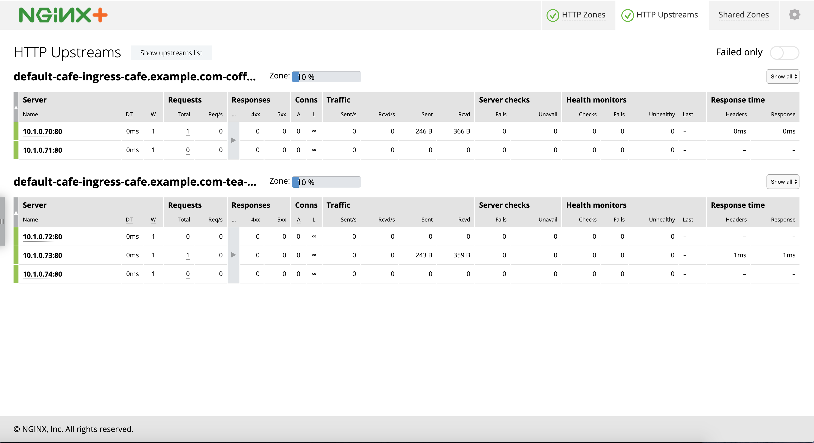

# Introduction 对于KIC中的描述的总结

主要的参考文件
References files
https://github.com/nginxinc/kubernetes-ingress/tree/master/examples/complete-example

Modification based on self-test purpose. You should consult that link above to go through all the steps before dive in.
1. Based on NGINX Plus. Remove the related nginx description.
2. You need to create the NGINX Plus ingress image.

Demo ENV
Docker Desktop with Kubernetes installed.
Don't forget to configure the preference in the Docker Desktop to enable

```
{
  "insecure-registries": [
    "nexus.local:8082",
    "nexus.local:8083"
  ],
  "debug": true,
  "experimental": true
}
```

## Quick steps summary

In this example we deploy the NGINX Plus Ingress controller, a simple web application and then configure load balancing for that application using the Ingress resource.

## Running the Example

## 1. Deploy the Ingress Controller

1. Follow the installation [instructions](https://docs.nginx.com/nginx-ingress-controller/installation/installation-with-manifests/) to deploy the Ingress controller.

2. Save the public IP address of the Ingress controller into a shell variable:
    ```
    $ IC_IP=XXX.YYY.ZZZ.III
    or
    $ IC_IP=127.0.0.1
    ```
    ⚠️ Because I test on my local machine, so I changed this to 127.0.0.1
3. Save the HTTPS port of the Ingress controller into a shell variable:
    ```
    $ IC_HTTPS_PORT=<port number>
    ```
    you will get this port number when you deploy the NodePort in previous steps.

## 2. Deploy the Cafe Application 部署Cafe应用

Create the coffee and the tea deployments and services:
```
$ kubectl create -f cafe.yaml
```

## 3. Configure Load Balancing

1. Create a secret with an SSL certificate and a key:
    ```
    $ kubectl create -f cafe-secret.yaml
    ```

2. Create an Ingress resource:
    ```
    $ kubectl create -f cafe-ingress.yaml
    ```

## 4. Test the Application 测试

1. To access the application, curl the coffee and the tea services. We'll use ```curl```'s --insecure option to turn off certificate verification of our self-signed
certificate and the --resolve option to set the Host header of a request with ```cafe.example.com```
    ⚠️ 这里做测试的时候，如果是localhost也会出问题。所以必须是127.0.0.1
    
    To get coffee:My example
    ```
    $ curl --resolve cafe.example.com:$IC_HTTPS_PORT:$IC_IP https://cafe.example.com:$IC_HTTPS_PORT/coffee --insecure
    Server address: 10.1.0.70:80
    Server name: coffee-6f758cc7cc-65dh8
    Date: 06/Apr/2020:10:20:34 +0000
    URI: /coffee
    Request ID: 3b08029787ecb1e5d1260d5b0edcd8b4
    ```
    If your prefer tea:
    ```
    $ curl --resolve cafe.example.com:$IC_HTTPS_PORT:$IC_IP https://cafe.example.com:$IC_HTTPS_PORT/tea --insecure
    Server address: 10.1.0.73:80
    Server name: tea-b88549687-fm9jk
    Date: 06/Apr/2020:10:24:41 +0000
    URI: /tea
    Request ID: 69094ff53e3dda4cda5b00efec5a3cd6
    ```
 2. View the status through Dashboard.html
    
    Get your pod name and run command
    
    ```
    $ kubectl port-forward <nginx-plus-ingress-pod> 8080:8080 --namespace=nginx-ingress
    ```
    Go to <https://docs.nginx.com/nginx-ingress-controller/logging-and-monitoring/status-page/#accessing-live-activity-monitoring-dashboard> to configure with more details.
    http://localhost:8080/dashboard.html#upstreams 
